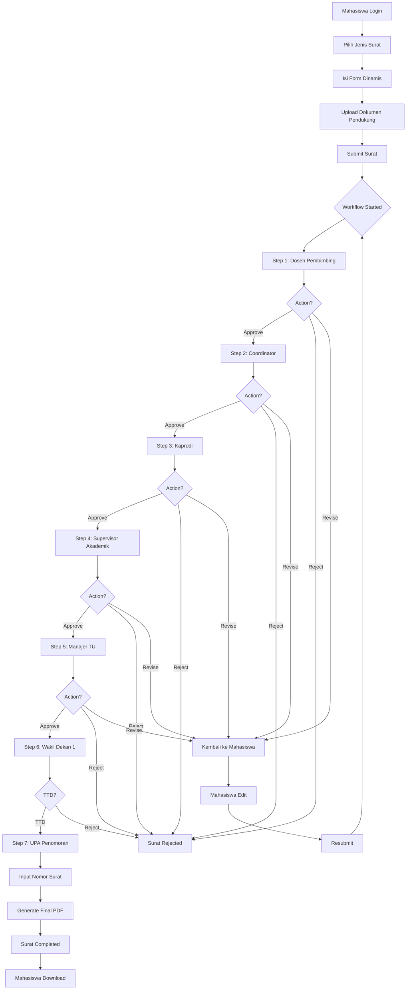

# 📋 DOKUMENTASI BISNIS PROSES E-OFFICE FSM UNDIP

**Versi:** 1.0  
**Tanggal:** 20 Januari 2026  
**Project:** Sistem E-Office Persuratan Fakultas Sains dan Matematika UNDIP

---

## 📖 DAFTAR ISI

1. [Overview Sistem](#1-overview-sistem)
2. [Struktur Organisasi](#2-struktur-organisasi)
3. [Roles & Permissions](#3-roles--permissions)
4. [Alur Bisnis Proses Utama](#4-alur-bisnis-proses-utama)
5. [User Journey](#5-user-journey)
6. [Workflow Examples](#6-workflow-examples)
7. [Business Rules](#7-business-rules)
8. [Edge Cases & Scenarios](#8-edge-cases--scenarios)

---

## 1. OVERVIEW SISTEM

### 1.1 Tujuan Sistem
Sistem E-Office FSM UNDIP adalah aplikasi berbasis web untuk mengelola proses persuratan di lingkungan Fakultas Sains dan Matematika Universitas Diponegoro, dengan fokus pada:
- Digitalisasi proses pengajuan dan approval surat
- Workflow approval yang terstruktur dan teraudit
- Tracking status surat real-time
- Disposisi tugas antar role
- Tanda tangan digital
- Penomoran surat otomatis

### 1.2 Scope
**Dalam Scope:**
- Surat Keluar (Outgoing Letter) dari mahasiswa
- Workflow approval multi-step
- Disposisi tugas
- Tanda tangan digital
- Penomoran manual
- Dashboard & reporting basic

**Luar Scope (Phase 1):**
- Surat Masuk (Incoming Letter) dari eksternal
- Integrasi SIAKAD (API)
- Email notification
- Mobile app
- Export Excel/PDF batch

### 1.3 Users
- **Mahasiswa:** ~500 orang
- **Dosen/Staff:** ~50 orang
- **Admin:** ~2 orang
- **Concurrent Users (Peak):** ~50 users
- **Surat/Bulan (Peak):** ~100 surat
- **Surat/Bulan (Normal):** ~50 surat

---

## 2. STRUKTUR ORGANISASI

### 2.1 Hierarchy
```
Fakultas Sains dan Matematika (FSM)
│
├── Departemen Informatika
│   ├── Program Studi S1 Informatika
│   │   └── Mahasiswa S1 Informatika
│   └── Program Studi S2 Informatika
│       └── Mahasiswa S2 Informatika
│
├── Departemen Matematika
│   ├── Program Studi S1 Matematika
│   └── Program Studi S2 Matematika
│
└── Departemen Fisika
    ├── Program Studi S1 Fisika
    └── Program Studi S2 Fisika
```

### 2.2 Unit Relationship
- **Fakultas** (root)
  - **Departemen** (child of Fakultas)
    - **Program Studi** (child of Departemen)
      - **Mahasiswa** (belongs to Program Studi)

**Unit Hierarchy Traversal:**
- Jika tidak ada role di level Program Studi → naik ke Departemen
- Jika tidak ada role di level Departemen → naik ke Fakultas
- Maximum depth: 5 levels

---

## 3. ROLES & PERMISSIONS

### 3.1 Role Types

| Role | Scope | Responsibilities | Permissions |
|------|-------|------------------|-------------|
| **Mahasiswa** | Program Studi | Mengajukan surat | Create draft, Submit, Self-revise, View own letters |
| **Dosen Pembimbing** | Program Studi | Approve surat bimbingan | Approve, Reject, Revise, Disposisi |
| **Coordinator PKL/Penelitian** | Departemen | Koordinasi PKL/Penelitian | Approve, Reject, Revise, Disposisi |
| **Ketua Prodi (Kaprodi)** | Program Studi | Approve surat prodi | Approve, Reject, Revise, Disposisi |
| **Supervisor Akademik** | Departemen | Verifikasi akademik | Approve, Reject, Revise |
| **Manajer Tata Usaha** | Fakultas | Administrasi surat | Approve, Reject, TTD |
| **Dekan** | Fakultas | Persetujuan dekan | Approve, Reject, Revise, Disposisi |
| **Wakil Dekan 1/2/3** | Fakultas | Persetujuan & TTD | Approve, Reject, TTD |
| **UPA** | Fakultas | Penomoran surat | Input nomor surat |
| **Admin Departemen** | Departemen | Manage surat departemen | Override ALL actions di scope departemen |
| **Admin Fakultas** | Fakultas | Manage sistem | Override ALL actions, Manage workflow, Manage templates |

### 3.2 Permission Matrix

| Action | Mahasiswa | Dosen | Kaprodi | Dekan | WD | Admin |
|--------|-----------|-------|---------|-------|-----|-------|
| Create Draft | ✅ | ❌ | ❌ | ❌ | ❌ | ✅ |
| Submit Letter | ✅ | ❌ | ❌ | ❌ | ❌ | ✅ |
| Self-Revise | ✅ | ❌ | ❌ | ❌ | ❌ | ❌ |
| Approve Step | ❌ | ✅ | ✅ | ✅ | ✅ | ✅ (override) |
| Reject Step | ❌ | ✅ | ✅ | ✅ | ✅ | ✅ (override) |
| Revise Step | ❌ | ✅ | ✅ | ✅ | ✅ | ✅ (override) |
| Create Disposisi | ❌ | ✅ | ✅ | ✅ | ✅ | ✅ (override) |
| TTD | ❌ | ❌ | ❌ | ❌ | ✅ | ✅ (override) |
| Penomoran | ❌ | ❌ | ❌ | ❌ | ❌ | ✅ (UPA/Admin) |
| View All Letters | ❌ | Unit only | Unit only | All | All | All |
| Edit Letter Data | ❌ | ❌ | ❌ | ❌ | ❌ | ✅ |
| Delete Letter | ❌ | ❌ | ❌ | ❌ | ❌ | ✅ |
| Manage Workflow | ❌ | ❌ | ❌ | ❌ | ❌ | ✅ |
| Manage Templates | ❌ | ❌ | ❌ | ❌ | ❌ | ✅ |

### 3.3 Role Assignment Rules
- **1 Role = 1 User** (kecuali Dosen Pembimbing yang bisa banyak)
- **1 User bisa punya multiple roles** (contoh: Kaprodi sekaligus Dosen Pembimbing)
- **Role terikat dengan Unit** (contoh: Kaprodi S1 Informatika ≠ Kaprodi S2 Informatika)

---

## 4. ALUR BISNIS PROSES UTAMA

### 4.1 High-Level Process Flow



### 4.2 Process Stages

#### **Stage 1: Persiapan Surat (Mahasiswa)**
1. Mahasiswa login ke sistem
2. Pilih menu "Buat Surat Baru"
3. Pilih jenis surat dari dropdown (contoh: "Surat Pengantar PKL")
4. Sistem menampilkan form dinamis sesuai jenis surat
5. Mahasiswa mengisi form:
   - Data diri (auto-fill dari database)
   - Field spesifik (contoh: tempat PKL, durasi)
   - Upload dokumen pendukung (proposal, KTM, dll)
6. Sistem generate preview PDF dari template
7. Mahasiswa review preview
8. Mahasiswa save sebagai DRAFT atau langsung SUBMIT

**Output:** Surat dengan status DRAFT atau PROCESSING

---

#### **Stage 2: Workflow Approval (Multi-Step)**

**Step 1: Dosen Pembimbing**
- **Trigger:** Mahasiswa submit surat
- **Assignment:** Auto-assign ke dosen pembimbing mahasiswa (dari database)
- **Actions:**
  - **Approve:** Kirim ke step berikutnya (dengan/tanpa pesan)
  - **Reject:** Surat ditolak, workflow selesai (wajib pesan min 10 char)
  - **Revise:** Kembalikan ke mahasiswa untuk perbaikan (wajib pesan)
  - **Disposisi:** Tugaskan ke staff/dosen lain untuk persiapan dokumen
- **Time limit:** 24 jam (setelah itu auto-reminder)
- **Notification:** Email + In-app notification

**Step 2: Coordinator PKL/Penelitian**
- **Trigger:** Step 1 approved
- **Assignment:** Auto-assign berdasarkan role "Coordinator PKL" di departemen
- **Actions:** Sama seperti Step 1
- **Additional:** Bisa tambah form field (contoh: "Catatan Coordinator")

**Step 3: Ketua Program Studi (Kaprodi)**
- **Trigger:** Step 2 approved
- **Assignment:** Auto-assign ke Kaprodi prodi mahasiswa
- **Actions:** Sama seperti Step 1
- **Special:** Kaprodi bisa lihat semua surat di prodi-nya

**Step 4: Supervisor Akademik**
- **Trigger:** Step 3 approved
- **Assignment:** Auto-assign ke Supervisor Akademik departemen
- **Actions:** Approve/Reject/Revise (no disposisi)
- **Focus:** Verifikasi data akademik (IPK, semester, dll)

**Step 5: Manajer Tata Usaha**
- **Trigger:** Step 4 approved
- **Assignment:** Auto-assign ke Manajer TU fakultas
- **Actions:** Approve/Reject atau TTD (tergantung workflow)
- **Additional:** Bisa upload lampiran tambahan

**Step 6: Wakil Dekan 1 (Final Approval + TTD)**
- **Trigger:** Step 5 approved
- **Assignment:** Auto-assign ke Wakil Dekan 1
- **Actions:**
  - **Approve + TTD:** Upload gambar TTD atau live signature pad
  - **Reject:** Surat ditolak
- **Output:** PDF dengan TTD terembed

**Step 7: UPA Penomoran**
- **Trigger:** Step 6 TTD
- **Assignment:** Auto-assign ke UPA
- **Action:** Input nomor surat manual (format bebas)
- **Validation:** Cek duplikasi nomor
- **Output:** PDF final dengan nomor surat

**Step 8: Notifikasi Selesai**
- **Trigger:** Step 7 selesai
- **Action:** Auto-notify mahasiswa
- **Status:** COMPLETED
- **Output:** Mahasiswa bisa download PDF final

---

#### **Stage 3: Skenario Khusus**

**A. Self-Revision oleh Mahasiswa**
```
Timeline:
1. Mahasiswa submit surat → Step 1 approved → Step 2 pending
2. Mahasiswa sadar salah input data
3. Mahasiswa klik "Ajukan Revisi Sendiri"
4. Sistem validasi:
   - Cek status = PROCESSING ✅
   - Cek belum di step TTD ✅
   - Cek ada step yang sudah approved ✅
5. Workflow mundur 1 step (ke Step 1)
6. Step 1-2 reset ke "waiting"
7. Step 1 set "pending" (perlu re-approval)
8. Mahasiswa edit data
9. Mahasiswa resubmit
10. Step 1 approver dapat notifikasi "Surat diresubmit setelah revisi"
11. Workflow jalan ulang dari Step 1
```

**Rules:**
- Bisa revisi unlimited
- Hanya sebelum step TTD
- Mundur ke step terakhir yang approved
- Approver yang sudah approve harus review ulang

---

**B. Revise oleh Approver**
```
Timeline:
1. Kaprodi review surat di Step 3
2. Kaprodi klik "Revise" + isi alasan (min 10 char)
3. Workflow kembali ke mahasiswa
4. Status surat: NEED_REVISION
5. Mahasiswa dapat notifikasi
6. Mahasiswa edit data
7. Mahasiswa resubmit
8. Workflow mulai dari awal (Step 1)
```

**Perbedaan dengan Self-Revision:**
- Self-revision: Mahasiswa inisiatif, mundur 1 step
- Revise by approver: Approver inisiatif, reset total

---

**C. Disposisi (Task Delegation)**
```
Timeline:
1. Kaprodi sedang review surat di Step 3
2. Kaprodi butuh dokumen tambahan dari Staff TU
3. Kaprodi klik "Buat Disposisi"
4. Isi form disposisi:
   - Ditugaskan ke: [Pilih user - Staff TU]
   - Instruksi: "Tolong siapkan transkrip nilai terbaru"
   - Priority: URGENT (default semua urgent)
5. Submit disposisi
6. Staff TU dapat notifikasi
7. Kaprodi TIDAK BISA approve sebelum disposisi selesai (BLOCKING)
8. Staff TU buka disposisi → upload dokumen → mark "Completed"
9. Kaprodi dapat notifikasi "Disposisi selesai"
10. Kaprodi bisa approve step 3
```

**Rules:**
- Disposisi BLOCKING (harus selesai dulu)
- Bisa nested (Staff TU disposisi lagi ke user lain)
- Semua disposisi priority: URGENT
- No deadline

---

**D. Admin Override**
```
Scenario:
- Kaprodi sedang cuti/sakit
- Surat urgent butuh approval
- Admin Departemen bisa override

Timeline:
1. Admin Departemen login
2. Buka detail surat yang pending di Kaprodi
3. Sistem deteksi: Admin punya akses override (scope departemen)
4. Muncul button "Override Approval"
5. Admin klik override
6. Isi form:
   - Action: Approve/Reject/Revise
   - Pesan override: (wajib min 10 char)
7. Submit override
8. Sistem:
   - Execute action (approve)
   - Log: "Approved by Dr. Ahmad (Kaprodi) - Overridden by Admin Budi"
   - Notify Kaprodi asli: "Surat sudah di-override admin"
9. Workflow lanjut ke step berikutnya
```

**Rules:**
- Admin Departemen: Override step di scope departemen saja
- Admin Fakultas: Override semua step
- Wajib pesan (min 10 char)
- Audit trail lengkap
- Notify user asli

---

**E. Messaging antar Role**
```
Timeline:
1. Step 2 (Coordinator) review surat
2. Coordinator approve + tulis pesan: "Data sudah benar, lanjutkan"
3. Step 3 (Kaprodi) dapat notifikasi
4. Kaprodi buka surat → lihat pesan di timeline
5. Kaprodi reject + tulis pesan: "Semester masih salah"
6. Workflow terminated, mahasiswa dapat notifikasi
7. Mahasiswa lihat timeline:
   - ✅ Step 2: Coordinator approved - "Data sudah benar"
   - ✗ Step 3: Kaprodi rejected - "Semester masih salah"
```

**Rules:**
- Approve: Pesan optional
- Reject: Pesan wajib (min 10 char)
- Revise: Pesan wajib (min 10 char)
- Pesan bisa diedit/delete oleh pengirim
- Semua participant workflow bisa lihat pesan

---

## 5. USER JOURNEY

### 5.1 Journey: Mahasiswa Mengajukan Surat Pengantar PKL

**Persona:** Budi, Mahasiswa S1 Informatika Semester 7

**Goal:** Mendapatkan surat pengantar PKL untuk melamar di PT Maju Jaya

**Steps:**

1. **Login**
   - Budi akses `https://eoffice.fsm.undip.ac.id`
   - Login dengan SSO UNDIP (username: budi, password: ****)
   - Redirect ke dashboard

2. **Dashboard**
   - Lihat status surat:
     - 1 surat pending (Surat Keterangan Aktif - menunggu Kaprodi)
     - 2 surat approved
   - Klik button "Buat Surat Baru"

3. **Pilih Jenis Surat**
   - Dropdown muncul dengan opsi:
     - Surat Pengantar PKL
     - Surat Keterangan Aktif
     - Surat Rekomendasi Beasiswa
     - dll
   - Pilih "Surat Pengantar PKL"
   - Sistem load form dinamis

4. **Isi Form**
   - Data diri (auto-fill):
     - Nama: Budi Santoso
     - NIM: 24060121140001
     - Prodi: S1 Informatika
     - Semester: 7
   - Field khusus PKL:
     - Jenis Pengantar: [Pilih] PKL
     - Tempat PKL: PT Maju Jaya
     - Alamat: Jl. Sudirman No. 123, Semarang
     - Durasi: 3 bulan
   - Upload dokumen:
     - Proposal PKL (PDF, max 5MB) ✅
     - KTM (JPG, max 5MB) ✅
   - Preview muncul (PDF dengan template terisi)

5. **Submit**
   - Klik "Submit untuk Approval"
   - Konfirmasi: "Surat akan dikirim ke Dosen Pembimbing Anda"
   - Klik "Ya, Submit"
   - Success: "Surat berhasil disubmit. Nomor tracking: #SRT-2026-001"

6. **Tracking**
   - Redirect ke detail surat
   - Lihat timeline:
     ```
     ✅ Step 1: Mahasiswa Submit
        👤 Budi Santoso
        🕐 20 Jan 2026, 10:00
        💬 "Mohon diproses pak"
     
     ⏳ Step 2: Dosen Pembimbing - Menunggu
        👤 Dr. Ahmad (Dosen Pembimbing)
        Status: Pending approval
     ```

7. **Wait for Approval** (Day 1)
   - Budi dapat notifikasi: "Dr. Ahmad has approved your letter"
   - Timeline update:
     ```
     ✅ Step 2: Dosen Pembimbing Approved
        👤 Dr. Ahmad
        🕐 20 Jan 2026, 14:30
        💬 "Data sudah benar, saya approve"
     
     ⏳ Step 3: Coordinator PKL - Menunggu
     ```

8. **Revisi Request** (Day 2)
   - Notifikasi: "Prof. Siti mengajukan revisi"
   - Budi buka surat → lihat pesan:
     ```
     🔄 Step 3: Coordinator PKL Revisi
        👤 Prof. Siti
        💬 "Durasi PKL harus 4 bulan, bukan 3 bulan. Tolong perbaiki."
     ```
   - Status surat: NEED_REVISION

9. **Edit & Resubmit**
   - Klik "Edit Surat"
   - Ubah durasi: 3 bulan → 4 bulan
   - Klik "Resubmit"
   - Success: "Surat berhasil diresubmit"

10. **Final Approval** (Day 3-7)
    - Workflow berjalan lagi dari Step 2
    - Semua step approve
    - Step 6 (WD1) TTD
    - Step 7 (UPA) input nomor: 001/SK-FSM/I/2026
    - Status: COMPLETED

11. **Download**
    - Notifikasi: "Surat Anda telah selesai diproses"
    - Klik "Download PDF"
    - PDF final dengan:
      - Header FSM UNDIP
      - Nomor surat: 001/SK-FSM/I/2026
      - TTD Wakil Dekan 1
      - QR Code verification

---

### 5.2 Journey: Kaprodi Approve Surat

**Persona:** Dr. Budi, Ketua Prodi S1 Informatika

**Goal:** Review dan approve surat mahasiswa

**Steps:**

1. **Notifikasi**
   - Email: "You have 5 pending approvals"
   - Login ke sistem
   - Dashboard menampilkan:
     - 5 surat pending approval
     - 23 surat di prodi (this month)
     - 18 surat completed (this month)

2. **Review Surat**
   - Klik surat pertama
   - Lihat detail:
     - Mahasiswa: Andi (S1 Informatika)
     - Jenis: Surat Keterangan Aktif
     - Timeline: Step 1-2 approved, Step 3 (Kaprodi) pending
   - Lihat PDF preview
   - Lihat data form:
     - Semester: 5
     - Keperluan: Beasiswa Bank
     - IPK: 3.75

3. **Disposisi**
   - Dr. Budi butuh verifikasi IPK dari Staff TU
   - Klik "Buat Disposisi"
   - Isi:
     - Ditugaskan ke: Siti (Staff TU)
     - Instruksi: "Tolong verifikasi IPK mahasiswa ini dari SIAKAD"
   - Submit disposisi
   - Status: "Cannot approve until disposition completed"

4. **Wait Disposisi** (30 menit kemudian)
   - Notifikasi: "Disposition completed by Siti"
   - Siti upload screenshot IPK dari SIAKAD (3.75 ✅)

5. **Approve**
   - Dr. Budi review hasil disposisi
   - Data valid
   - Klik "Approve"
   - (Optional) Tambah pesan: "Data sudah terverifikasi"
   - Submit
   - Success: "Surat approved. Next step: Supervisor Akademik"

6. **Lanjut ke Surat Berikutnya**
   - Repeat untuk 4 surat lainnya
   - Total waktu: ~20 menit untuk 5 surat

---

### 5.3 Journey: Admin Override Approval

**Persona:** Admin Budi, Admin Departemen Informatika

**Goal:** Override approval karena Kaprodi cuti

**Steps:**

1. **Laporan Urgent**
   - Staff TU lapor: "Ada surat urgent, tapi Kaprodi cuti"
   - Admin Budi login

2. **Cari Surat**
   - Dashboard → Filter: "Pending di Kaprodi"
   - 1 surat muncul: Surat Pengantar PKL - Urgent
   - Klik detail surat

3. **Override**
   - Sistem deteksi: Admin punya akses override
   - Muncul box:
     ```
     🔑 Admin Override
     Anda dapat melakukan approval sebagai admin untuk step ini
     [Button: Override Approval]
     ```
   - Klik button

4. **Dialog Override**
   - Form muncul:
     - Step: Step 3 - Kaprodi
     - User asli: Dr. Ahmad (Kaprodi)
     - Action: [Pilih] Approve
     - Pesan override: (wajib min 10 char)
   - Isi pesan: "Override karena Kaprodi sedang cuti. Data sudah saya verifikasi dan approved."
   - Klik "Confirm Override"

5. **Result**
   - Success: "Step overridden successfully"
   - Timeline update:
     ```
     ✅ Step 3: Kaprodi Approved [OVERRIDE]
        👤 Dr. Ahmad (Kaprodi)
        🔑 Overridden by: Admin Budi
        🕐 20 Jan 2026, 09:15
        💬 "Override karena Kaprodi sedang cuti. Data sudah saya verifikasi dan approved."
     ```
   - Notifikasi ke Dr. Ahmad: "Surat #SRT-001 telah di-override oleh Admin"
   - Workflow lanjut ke Step 4

---

## 6. WORKFLOW EXAMPLES

### 6.1 Workflow: Surat Pengantar PKL (9 Steps)

```
Step 1: Mahasiswa [DRAFT]
  ↓ Submit
Step 2: Dosen Pembimbing [APPROVAL]
  ↓ Approve
Step 3: Coordinator PKL [APPROVAL]
  ↓ Approve
Step 4: Ketua Prodi [APPROVAL]
  ↓ Approve
Step 5: Supervisor Akademik [APPROVAL]
  ↓ Approve
Step 6: Manajer Tata Usaha [APPROVAL]
  ↓ Approve
Step 7: Wakil Dekan 1 [TTD]
  ↓ TTD
Step 8: UPA [PENOMORAN]
  ↓ Input Nomor
Step 9: Selesai → Mahasiswa [NOTIFICATION]
```

**Estimasi Waktu:**
- Normal: 5-7 hari kerja
- Fast-track: 2-3 hari kerja (jika semua approver responsive)

---

### 6.2 Workflow: Surat Keterangan Aktif (5 Steps)

```
Step 1: Mahasiswa [DRAFT]
  ↓ Submit
Step 2: Supervisor Akademik [APPROVAL]
  ↓ Approve
Step 3: Manajer Tata Usaha [TTD]
  ↓ TTD
Step 4: UPA [PENOMORAN]
  ↓ Input Nomor
Step 5: Selesai → Mahasiswa [NOTIFICATION]
```

**Estimasi Waktu:**
- Normal: 2-3 hari kerja
- Fast-track: Same day (jika urgent)

---

### 6.3 Custom Workflow (Configurable by Admin)

Admin bisa buat workflow custom via UI:

**Contoh: Surat Rekomendasi Beasiswa**
```
Admin define:
1. Step 1: Mahasiswa (DRAFT)
2. Step 2: Dosen Pembimbing (APPROVAL)
   - Form field tambahan: "Rekomendasi dosen" (textarea, required)
3. Step 3: Kaprodi (APPROVAL)
   - Form field: "Persetujuan Kaprodi" (checkbox, required)
4. Step 4: Wakil Dekan 3 (TTD + APPROVAL)
   - Skip Dekan (langsung WD3)
5. Step 5: UPA (PENOMORAN)
6. Step 6: Done
```

---

## 7. BUSINESS RULES

### 7.1 Surat Status Lifecycle

```
DRAFT → PROCESSING → COMPLETED
  ↓         ↓           ↑
  ↓    REJECTED        ↑
  ↓         ↓           ↑
  ↓  NEED_REVISION     ↑
  ↓         ↓           ↑
  ↓  SELF_REVISION     ↑
  └─────────┴───────────┘
```

**Status Transitions:**
- `DRAFT` → `PROCESSING` (saat submit)
- `PROCESSING` → `COMPLETED` (saat workflow selesai)
- `PROCESSING` → `REJECTED` (saat di-reject)
- `PROCESSING` → `NEED_REVISION` (saat approver revise)
- `PROCESSING` → `SELF_REVISION` (saat mahasiswa self-revise)
- `NEED_REVISION` → `PROCESSING` (saat resubmit)
- `SELF_REVISION` → `PROCESSING` (saat resubmit)

**Terminal States:**
- `COMPLETED` (tidak bisa diubah)
- `REJECTED` (tidak bisa direactivate, harus buat baru)

---

### 7.2 Approval Rules

**General:**
- Approver hanya bisa approve surat yang assigned ke dia
- Approval bisa dilakukan sekali per step
- Setelah approve, tidak bisa undo (kecuali admin override)
- Message optional saat approve
- Message wajib (min 10 char) saat reject/revise

**Disposisi:**
- Blocking: Harus selesai dulu sebelum bisa approve
- Nested: Penerima disposisi bisa disposisi lagi ke user lain
- No deadline: Semua urgent
- Bisa buat disposisi kapan saja (during/after workflow)

**TTD:**
- Hanya role dengan permission TTD yang bisa TTD
- TTD bisa upload gambar atau signature pad
- TTD disimpan untuk reuse
- Satu user bisa punya multiple TTD (pilih default)
- TTD tertempel di PDF saat generate final

**Penomoran:**
- Manual input oleh UPA atau Admin
- Format bebas (admin yang tentukan convention)
- Validasi duplikasi
- Nomor sequence reset per bulan dan tahun
- Setelah nomor di-assign, surat tidak bisa dibatalkan

---

### 7.3 Self-Revision Rules

**Kapan bisa:**
- Status = `PROCESSING` ✅
- Ada step yang sudah approved ✅
- Belum masuk step TTD ❌
- Belum step penomoran ❌

**Mekanisme:**
- Workflow mundur 1 step dari step terakhir yang approved
- Step yang sudah approved reset ke "pending" (need re-approval)
- Unlimited revisi

**Contoh:**
```
Current state:
  Step 1: Approved ✅
  Step 2: Approved ✅
  Step 3: Pending ⏳

Self-revise → Mundur ke Step 2:
  Step 1: Approved ✅
  Step 2: Pending (need re-approval)
  Step 3: Waiting

Mahasiswa edit → Resubmit → Step 2 approver review ulang
```

---

### 7.4 Admin Override Rules

**Scope:**
- Admin Departemen: Override step di role departemen saja
- Admin Fakultas: Override semua step

**Scope Detection:**
- Berdasarkan role user yang di-assign
  - Role "Dosen Pembimbing" (scope: Prodi) → Admin Departemen bisa override
  - Role "Kaprodi" (scope: Prodi) → Admin Departemen bisa override
  - Role "Dekan" (scope: Fakultas) → Admin Fakultas bisa override

**Actions:**
- Bisa override: Approve, Reject, Revise, TTD, Penomoran, Disposisi (ALL)
- Wajib pesan (min 10 char)
- Audit trail: Log siapa yang override

**Notification:**
- User asli yang seharusnya approve dapat notifikasi
- Timeline menampilkan "Overridden by Admin"

---

### 7.5 Notification Rules

**Triggers:**
- Surat assigned ke user → Notify user
- Step approved → Notify mahasiswa + next approver
- Step rejected → Notify mahasiswa
- Step revised → Notify mahasiswa
- Disposisi created → Notify assignee
- Disposisi completed → Notify creator
- Override → Notify original user
- 24 jam belum approve → Reminder notification

**Channels:**
- In-app notification (badge + list)
- No email (Phase 1)

---

### 7.6 File Upload Rules

**Limits:**
- Max file size: 5 MB per file
- Allowed types: Admin yang tentukan per field (PDF, JPG, PNG, DOCX)
- Max jumlah file: Admin yang tentukan per field
- Total storage per surat: 25 MB

**Validation:**
- File size check (client + server)
- MIME type check
- Virus scan (optional, Phase 2)

---

### 7.7 Template Rules

**Management:**
- Admin upload DOCX template via UI
- Placeholder syntax: `{field_name}`
- Bisa variasi per unit (Template Informatika ≠ Template Matematika)

**Auto-update:**
- Kalau template diupdate → Surat existing auto-update ke template baru
- PDF regenerate saat workflow lanjut

**Placeholders:**
- `{student_name}`, `{student_nim}`, `{student_prodi}`
- `{form_data.field_name}` - Data dari form dinamis
- `{recipient}` - Tujuan surat
- `{current_date}` - Tanggal otomatis
- `{letter_number}` - Nomor surat (setelah penomoran)
- `{signature_X}` - TTD di step X

---

## 8. EDGE CASES & SCENARIOS

### 8.1 Race Condition: Concurrent Approval

**Scenario:**
- 2 admin override bersamaan untuk step yang sama

**Solution:**
- Database lock pada WorkflowStepExecution.status
- Optimistic locking dengan version number
- First come first serve
- Second admin dapat error: "Step sudah diproses oleh admin lain"

---

### 8.2 Approver Resign/Inactive

**Scenario:**
- Kaprodi resign, ada 10 surat pending approval

**Solution:**
- Admin Departemen bisa mass-assign ke Kaprodi baru
- Atau admin override satu-satu
- Atau auto-escalate setelah 7 hari (Phase 2)

---

### 8.3 Workflow Stuck (No Approver)

**Scenario:**
- Workflow butuh "Coordinator PKL" tapi role kosong (tidak ada user)

**Solution:**
- Saat submit, validasi: Cek semua step punya assignee
- Kalau ada step tanpa assignee → Error: "Workflow tidak bisa dimulai. Role XXX tidak ada user."
- Admin harus assign user ke role dulu

---

### 8.4 Disposisi Infinite Loop

**Scenario:**
- User A disposisi ke User B
- User B disposisi ke User A
- Infinite loop

**Solution:**
- Disposisi hanya bisa ke "role di bawah" (hierarki unit)
- Validasi: Cek history disposisi, tidak boleh assign ke user yang sudah pernah create disposisi di chain ini

---

### 8.5 Self-Revise During Disposisi

**Scenario:**
- Kaprodi buat disposisi ke Staff TU
- Mahasiswa self-revise sementara disposisi masih pending

**Solution:**
- Self-revise auto-cancel semua disposisi yang belum completed
- Notify disposisi assignee: "Disposisi dibatalkan karena surat di-revisi"

---

### 8.6 Nomor Surat Duplikat

**Scenario:**
- UPA input nomor 001/SK-FSM/I/2026
- Sudah ada surat dengan nomor yang sama

**Solution:**
- Real-time validation saat input
- Error: "Nomor surat sudah digunakan"
- Suggest next available number

---

### 8.7 Template Placeholder Missing

**Scenario:**
- Template punya placeholder `{form_data.tempat_pkl}`
- Form tidak ada field `tempat_pkl` (typo: `tempat_PKL`)

**Solution:**
- PDF generation tetap jalan
- Placeholder yang tidak ketemu → replace dengan "[FIELD NOT FOUND]"
- Admin dapat warning email
- Log error untuk debugging

---

### 8.8 File Upload Fail (MinIO Down)

**Scenario:**
- Mahasiswa upload file, MinIO server down

**Solution:**
- Retry 3x dengan exponential backoff
- Kalau masih gagal → Error message: "File upload gagal, silakan coba lagi"
- Draft tetap tersimpan (tanpa file)
- Mahasiswa bisa edit draft dan upload ulang nanti

---

### 8.9 PDF Generation Timeout

**Scenario:**
- Template besar (50 halaman) + banyak gambar
- LibreOffice conversion timeout (>30 detik)

**Solution:**
- Async PDF generation (queue-based)
- User tidak nunggu, dapat notifikasi saat PDF ready
- Retry jika gagal
- Fallback: Notify admin untuk manual generation

---

### 8.10 Mahasiswa Lulus/Drop Out

**Scenario:**
- Mahasiswa punya 3 surat pending
- Mahasiswa drop out / lulus
- Account di-nonaktifkan

**Solution:**
- Workflow tetap jalan (tidak auto-cancel)
- Admin bisa override semua step
- Surat tetap bisa completed untuk keperluan administrasi

---

## 9. PERFORMANCE & SCALABILITY

### 9.1 Expected Load
- **Concurrent Users (Peak):** 50 users
- **Surat/Bulan (Peak):** 100 surat
- **Response Time Target:** < 2 detik per request
- **Uptime Target:** 99% (7.2 jam downtime/bulan)

### 9.2 Database Optimization
- Index pada foreign keys
- Index pada status columns
- Pagination untuk list queries (max 20 items per page)
- Caching untuk dropdown data (roles, units, letter types)

### 9.3 File Storage
- MinIO with auto-cleanup (delete files dari surat yang older than 2 tahun)
- Compression untuk PDF (optimize file size)
- CDN untuk serve static files (Phase 2)

---

## 10. SECURITY & COMPLIANCE

### 10.1 Authentication
- SSO UNDIP integration (optional)
- Better-Auth (session-based)
- Password hashing (bcrypt)
- Session timeout: 8 jam

### 10.2 Authorization
- Role-based access control (RBAC)
- Permission check di setiap endpoint
- Unit-based data isolation (Kaprodi hanya lihat surat prodi-nya)

### 10.3 Audit Trail
- Log semua actions (create, update, delete, override)
- Track user, timestamp, IP address
- Immutable audit log (append-only)
- Retention: 5 tahun

### 10.4 Data Privacy
- Mahasiswa hanya lihat surat sendiri
- Approver hanya lihat surat di unit-nya
- Admin lihat semua (dengan audit log)
- GDPR-compliant (data deletion pada request)

---

## 11. GLOSSARY

| Term | Definisi |
|------|----------|
| **Workflow** | Template proses approval multi-step |
| **Workflow Instance** | Running instance dari workflow untuk surat tertentu |
| **Step Execution** | Record approval di satu step workflow |
| **Disposisi** | Delegasi tugas dari approver ke user lain |
| **Self-Revision** | Mahasiswa mengajukan revisi sendiri saat workflow berjalan |
| **Override** | Admin melakukan action atas nama user lain |
| **TTD** | Tanda tangan digital yang tertempel di PDF |
| **Penomoran** | Proses input nomor surat manual |
| **Blocking Disposisi** | Disposisi yang harus selesai dulu sebelum bisa approve |
| **Timeline** | History linear dari semua action di workflow |
| **Message** | Pesan/notes yang ditulis saat approve/reject/revise |

---

## 12. APPENDIX

### 12.1 Diagram ER Database
(See: `docs/database-erd.png`)

### 12.2 API Documentation
(See: `docs/api-documentation.md`)

### 12.3 UI/UX Mockups
(See: `docs/ui-mockups/`)

### 12.4 Change Log
| Version | Date | Changes | Author |
|---------|------|---------|--------|
| 1.0 | 20 Jan 2026 | Initial documentation | AI Assistant |

---

**END OF DOCUMENT**

*Dokumentasi ini adalah living document dan akan diupdate seiring perkembangan project.*
